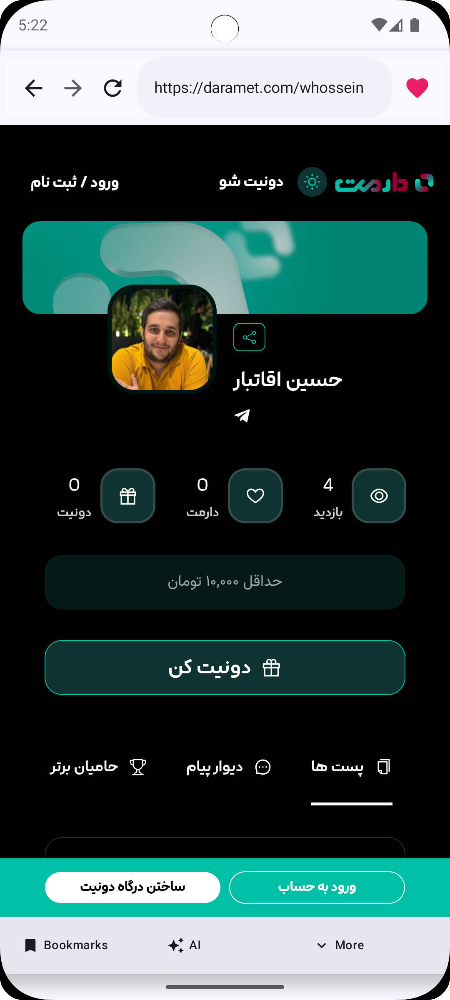
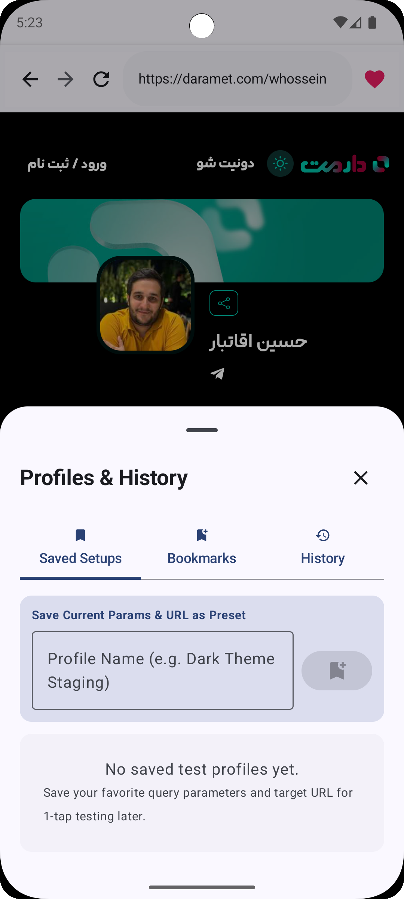
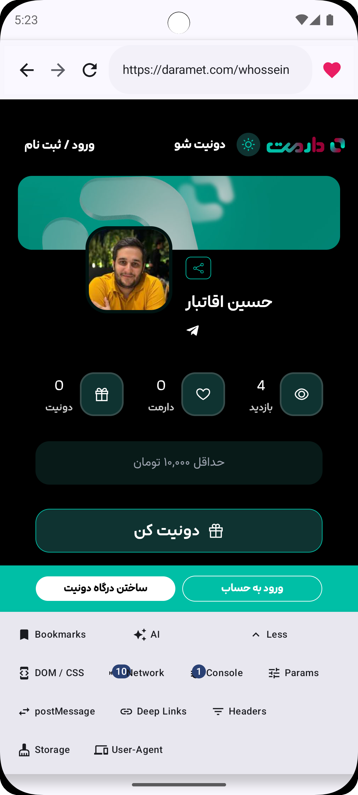
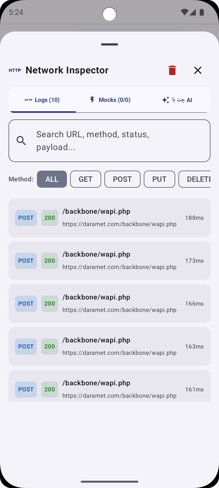
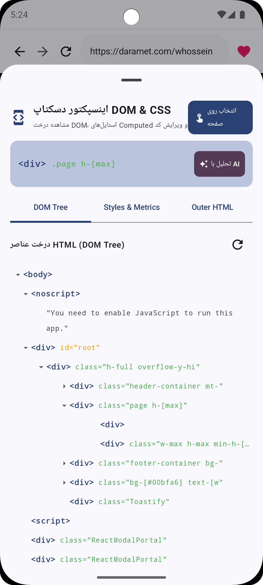

# PWA Inspector & Test App

A comprehensive Android application for web developers and testers to inspect, debug, and test websites, Progressive Web Apps (PWAs), and WebViews directly on mobile devices.

## 📸 Screenshots

  
  
  
  
  

## 🌟 Features

*   **DOM Inspector**: View and interact with the DOM structure of any website.
*   **Network Inspector**: Monitor network requests, view details, and mock API responses.
*   **JavaScript Console**: View console logs and execute JavaScript code directly in the WebView.
*   **URL Search Parameters**: Easily manage and modify URL query parameters.
*   **Bookmarks & Profiles**: Save websites and create isolated profiles to manage settings and applied changes.
*   **PostMessage Tester**: Send and debug `postMessage` events for cross-origin or WebView communication.
*   **Deep Link Tester**: Test incoming Deep Links and App Links directly within the app.
*   **Custom User Agent**: Simulate different browsers and environments.
*   **Cache & Storage Management**: Clear Cache, Cookies, and Local/Session Storage instantly.
*   **AI Assistant**: Built-in AI assistant to help analyze DOM structures and generate mock data for network requests.

## 🛠️ Tech Stack

*   **Language**: [Kotlin](https://kotlinlang.org/)
*   **UI Toolkit**: [Jetpack Compose](https://developer.android.com/jetpack/compose) (Material 3)
*   **Architecture**: MVVM (Model-View-ViewModel)
*   **Local Storage**: [Room Database](https://developer.android.com/training/data-storage/room)
*   **Asynchronous Programming**: Coroutines & Flow

## 🚀 Getting Started

To build and run the project locally:

1.  Clone this repository.
2.  Open the project in **Android Studio** (Koala or newer recommended).
3.  Let Gradle sync the project dependencies.
4.  Build and Run the `app` module on a physical device or Android Emulator.

## 🤝 Contributing

We welcome contributions! Please see the [CONTRIBUTING.md](CONTRIBUTING.md) file for details on how to get started, report bugs, or submit pull requests.

## 💖 Support

If you find this tool helpful in your development workflow, consider supporting its development:
👉 [Donate via Daramet](https://daramet.com/whossein)

---
*Built to make mobile web debugging easier.* ❤️
